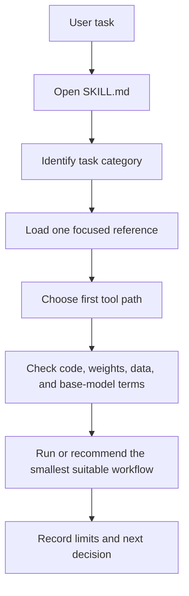
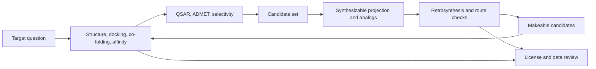

# BioSymphony Small Molecules

BioSymphony Small Molecules is an agent skill for choosing open tools in small-molecule design.

> Agent skill for routing small-molecule design tasks to open tools, focused references, and license-aware implementation paths.

It gives Claude Code, Codex, Symphony, and other agent harnesses a structured map for:

- synthesizable molecule generation and analog design
- retrosynthesis, reaction prediction, templates, and makeability scoring
- protein structure prediction, docking, co-folding, and binding affinity
- QSAR, ADMET, selectivity, and pocket-conditioned generation
- code, weights, data, and base-model license terms

The goal is practical routing. An agent can read the skill, pick the right reference file, choose a starting tool, and keep the licensing and data constraints visible while it works through a long design task.

## What This Improves

| Agent need | What this repo adds |
|---|---|
| Pick a starting method | Task routing in [`SKILL.md`](SKILL.md) and the compact tool matrix |
| Avoid loading too much context | Focused reference files by workflow category |
| Compare tools quickly | Tool cards with task fit, license notes, weights, data, and status |
| Connect target work to synthesis | A two-layer loop from target scoring back to makeable molecules |
| Keep public demos small | A compact KRAS molecular-glue example with public inputs and summaries |

## Agent Flow



## Design Loop



## How Agents Use It

Open [`SKILL.md`](SKILL.md). The skill routes by task:

- generate makeable analogs of a hit
- project a molecule into synthesizable space
- plan or check a synthesis route
- dock a ligand or co-fold a protein-ligand complex
- estimate binding affinity with an ML or free-energy method
- build QSAR, ADMET, or off-target screens
- generate molecules into a binding pocket
- check whether a tool can be used in commercial work

The reference files are plain Markdown. They work as agent context and as human-readable notes.

For Claude Code-style skill discovery:

```bash
ln -s "$(pwd)" ~/.claude/skills/small-molecule-design-tools
```

The skill name is `small-molecule-design-tools`.

## What Is Included

```text
SKILL.md                         agent entry point and routing table
references/tool-matrix.md        compact index of tools by task
references/licensing-and-data.md code, weights, data, and base-model checklist
references/*.md                  focused tool cards by category
demos/kras-glue/                 compact public-data demo on PDB 9BG6
assets/readme-banner.png         curated README banner image
scripts/public_audit.py          public-release scan for local paths, secrets, and links
```

The reference layer covers about 130 tools. The synthesizability layer was checked on 2026-06-11. The target-based layer was checked on 2026-06-13.

## Start Points

| Start here | Use it for |
|---|---|
| [references/tool-matrix.md](references/tool-matrix.md) | One table across all tool categories |
| [references/licensing-and-data.md](references/licensing-and-data.md) | Code, weights, data, and base-model terms |
| [references/synthesizable-generation.md](references/synthesizable-generation.md) | Makeable molecule generation and analog design |
| [references/retrosynthesis-planning.md](references/retrosynthesis-planning.md) | Multi-step synthesis planning |
| [references/docking-and-cofolding.md](references/docking-and-cofolding.md) | Docking, co-folding, pose, and affinity tools |
| [references/binding-affinity-and-fep.md](references/binding-affinity-and-fep.md) | OpenFE, OpenMM, MM-GBSA, and related methods |
| [references/worked-example-kras-glue.md](references/worked-example-kras-glue.md) | Applying the layers to a public KRAS molecular-glue structure |

## Public Repo Boundary

This repo contains docs, skill instructions, compact public-data examples, and small result summaries. It does not include model weights, vendor catalogs, non-public molecules, non-public structures, raw cloud outputs, or large media builds.

Run the public-release check:

```bash
make release-check
```

This compiles the public Python scripts, checks local Markdown links, and scans for local workstation paths, secrets, and oversized files.

## License

The repo content is MIT licensed. Upstream tools keep their own licenses. The reference cards separate source code, model weights, data, and base-model terms because those terms often differ.
