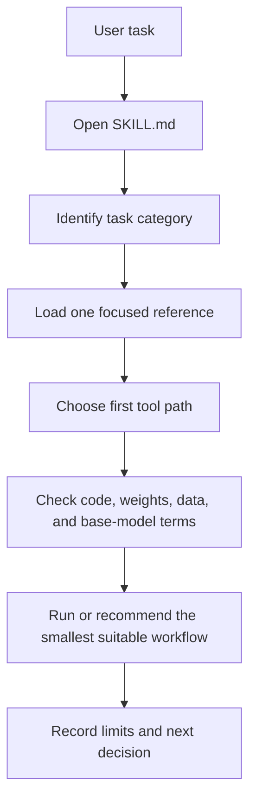
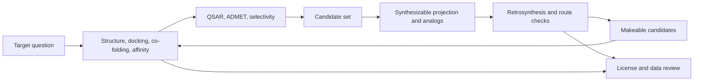

# BioSymphony Small Molecules

BioSymphony Small Molecules is an agent skill for choosing open and publicly
documented tools in small-molecule design.

Use the skill with Claude Code, Codex, Symphony, or another agent harness to:

- generate synthesizable molecules and design analogs
- plan retrosynthesis and assess reactions, templates, and makeability
- choose protein-structure, docking, co-folding, and affinity methods
- choose QSAR, ADMET, selectivity, and pocket-conditioned methods
- check code, model weights, data, and base-model terms

## Repository Features

| Agent need | What this repository adds |
|---|---|
| Pick a starting method | Task routing in [`SKILL.md`](SKILL.md) and the compact tool matrix |
| Avoid loading too much context | Focused reference files by workflow category |
| Compare tools quickly | Tool cards with task fit, license notes, weights, data, and status |
| Connect target work to synthesis | A two-layer loop from target scoring back to makeable molecules |
| Keep public demos small | A compact KRAS molecular-glue example with public inputs and summaries |

## Agent Flow


```mermaid
flowchart TD
    A["User task"] --> B["Open SKILL.md"]
    B --> C["Identify task category"]
    C --> D["Load one focused reference"]
    D --> E["Choose first tool path"]
    E --> F["Check code, weights, data, and base-model terms"]
    F --> G["Run or recommend the smallest suitable workflow"]
    G --> H["Record limits and next decision"]
```

## Design Loop


```mermaid
flowchart LR
    A["Target question"] --> B["Structure, docking, co-folding, affinity"]
    B --> C["QSAR, ADMET, selectivity"]
    C --> D["Candidate set"]
    D --> E["Synthesizable projection and analogs"]
    E --> F["Retrosynthesis and route checks"]
    F --> G["Makeable candidates"]
    G --> B
    F --> H["License and data review"]
    B --> H
```

## How to Use It

Open [`SKILL.md`](SKILL.md). The skill routes by task:

- generate makeable analogs of a hit
- project a molecule into synthesizable space
- plan or check a synthesis route
- dock a ligand or co-fold a protein-ligand complex
- estimate binding affinity with an ML or free-energy method
- build QSAR, ADMET, or off-target screens
- generate molecules into a binding pocket
- check a tool's license and data terms for product-facing work

The reference files are plain Markdown. They work as agent context and as
human-readable notes.

For Claude Code-style skill discovery:

```bash
ln -s "$(pwd)" ~/.claude/skills/small-molecule-design-tools
```

The skill name is `small-molecule-design-tools`.

## What Is Included

```text
SKILL.md                         agent entry point and routing table
references/tool-matrix.md        compact index of tools by task
references/licensing-and-data.md code, weights, data, and base-model checklist
references/*.md                  focused tool cards by category
demos/kras-glue/                 compact public-data demo on PDB 9BG6
assets/readme-banner.png         selected README banner image
scripts/public_audit.py          public-release scan for paths, secrets, archives, links, and package drift
```

The tool matrix contains 154 indexed rows across 18 categories. Grouped entries
and cross-references count as one row each.

## Start Points

| Start here | Use it for |
|---|---|
| [references/tool-matrix.md](references/tool-matrix.md) | One table across all tool categories |
| [references/licensing-and-data.md](references/licensing-and-data.md) | Code, weights, data, and base-model terms |
| [references/synthesizable-generation.md](references/synthesizable-generation.md) | Makeable molecule generation and analog design |
| [references/retrosynthesis-planning.md](references/retrosynthesis-planning.md) | Multi-step synthesis planning |
| [references/docking-and-cofolding.md](references/docking-and-cofolding.md) | Docking, co-folding, pose, and affinity tools |
| [references/binding-affinity-and-fep.md](references/binding-affinity-and-fep.md) | OpenFE, OpenMM, MM-GBSA, and related methods |
| [references/lddm.md](references/lddm.md) | LDDM capabilities, checkpoint terms, measured limits, and selection guidance |
| [references/worked-example-kras-glue.md](references/worked-example-kras-glue.md) | Applying the layers to a public KRAS molecular-glue structure |

## Public Repository Boundary

This repository contains documentation, skill instructions, compact public-data
examples, and small result summaries. It excludes model weights, vendor
catalogs, non-public scientific data, raw service output, and large generated
media.

Run the public-release check:

```bash
make release-check
```

This command compiles the public Python scripts, checks local Markdown links,
and scans for local paths, secrets, archives, oversized files, unsafe symlinks,
and drift between the root references and the packaged skill.

## License

The repository content uses the MIT License. Each upstream project sets its own
terms. The reference cards track source code, model weights, data, and base
models separately because one project can apply different terms to each layer.
