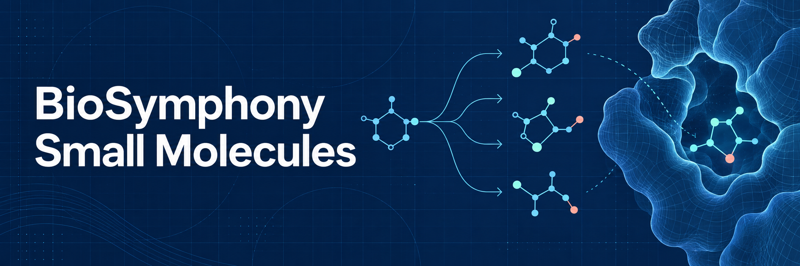
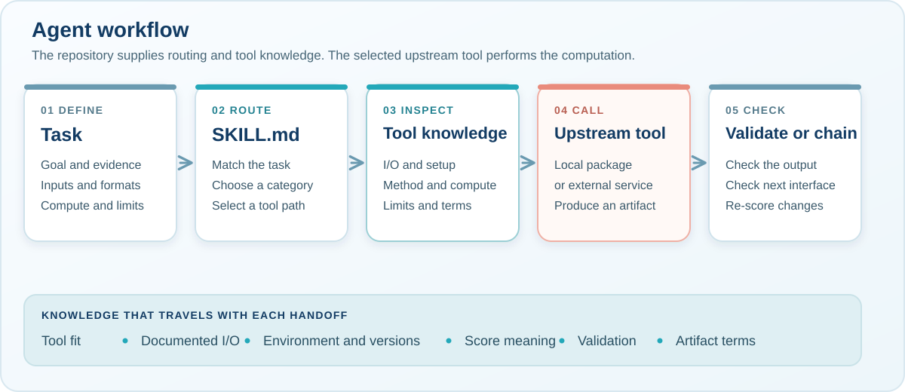

# BioSymphony Small Molecules

BioSymphony Small Molecules gives AI coding agents a tool knowledge base for
small-molecule design. An agent can map a task to an upstream tool, prepare the
tool call with the required inputs and compute, and plan the handoffs from
generation to scoring, property prediction, and synthesis planning.

The repository supplies routing instructions and reference material. It does
not provide a universal invocation API or bundle every tool and checkpoint.
Each guide helps an agent decide what to install, what to pass to a tool, what
the output means, and which tools may use that output next.

## What agents can do



| Capability | What the repository supplies |
| --- | --- |
| Select a tool | Task routing, category comparisons, required inputs, and compute requirements |
| Prepare a tool call | Setup notes, model or checkpoint details, expected outputs, and documented limits |
| Chain tools | Documented inputs and outputs, candidate handoffs, and format requirements across the workflow |
| Check the result | Validation steps that separate pose confidence, predicted affinity, makeability, and experimental evidence |
| Check artifact terms | Separate notes for source code, model weights, data, and base models |

Before each tool call, record:

- The selected tool and why it fits the task
- The input artifact and format
- The environment, compute, model, checkpoint, or service requirement, when applicable
- The expected output and the meaning of its scores
- The validation step, proposed next tool, and any required format conversion
- The applicable code, weight, data, and base-model terms

## Example tool chain

An agent can assemble a target-to-route workflow from the category guides:

| Stage | Tool task | Start with |
| --- | --- | --- |
| 1. Prepare the target | Get or predict a receptor structure | [Protein structure prediction](references/protein-structure-prediction.md) |
| 2. Propose candidates | Generate candidates in a binding pocket | [Structure-based generation](references/structure-based-generation.md) |
| 3. Evaluate binding | Dock or co-fold generated or supplied compounds, then estimate affinity | [Docking and co-folding](references/docking-and-cofolding.md) and [binding affinity](references/binding-affinity-and-fep.md) |
| 4. Apply property filters | Predict activity, ADMET, and selectivity | [QSAR](references/property-and-qsar-prediction.md), [ADMET](references/admet-prediction.md), and [selectivity](references/target-and-selectivity-prediction.md) |
| 5. Preserve makeability | Project selected compounds into synthesizable space and re-score changed structures | [Synthesizable generation](references/synthesizable-generation.md) |
| 6. Plan the route | Generate or validate routes against the selected starting-material stock | [Retrosynthesis planning](references/retrosynthesis-planning.md) |

A supplied compound set can enter at stage 3 or 4. Each stage requires its
selected upstream package or service and any method, model, checkpoint, or data
named in the guide. The guides identify candidate handoffs. Verify each
upstream interface and convert formats when necessary.

## Use the skill

Clone the repository into a directory of your choice:

```bash
git clone https://github.com/BioSymphony/small-molecules.git
cd small-molecules
```

Ask your agent to read [SKILL.md](SKILL.md). State the task, available inputs,
compute, and usage constraints. For a multi-tool workflow, ask the agent to name
each tool's inputs, outputs, method or version, validation step, and artifact
terms.

For example:

> Read SKILL.md and design a CPU-only tool chain that plans a synthesis route
> for a target SMILES. For each call, specify the input, output, software or
> model version, starting-material stock, and route check.

> Read SKILL.md and design a pocket-to-route workflow that grows a fragment,
> validates the pose and predicted properties, projects selected compounds into
> synthesizable space, and plans routes. Name the handoff between each tool.

### Install for Claude Code

From the cloned repository directory, register the packaged skill in
[Claude Code's personal skills directory](https://code.claude.com/docs/en/skills):

```bash
mkdir -p ~/.claude/skills
ln -s "$(pwd)/skills/small-molecule-design-tools" ~/.claude/skills/small-molecule-design-tools
```

Keep the clone in that location so the link remains valid. If a skill with that
name is already installed, check its location before replacing it.

Invoke it with `/small-molecule-design-tools` followed by your task.
Other agents can read `SKILL.md` and its linked Markdown references directly.

## Find a reference

| Task | Reference |
|---|---|
| Compare tools across categories | [Tool matrix](references/tool-matrix.md) |
| Generate molecules with proposed synthesis routes or design analogs | [Synthesizable generation](references/synthesizable-generation.md) |
| Plan a route to a target molecule and check its starting materials | [Retrosynthesis planning](references/retrosynthesis-planning.md) |
| Dock ligands, predict complexes, and validate poses | [Docking and co-folding](references/docking-and-cofolding.md) |
| Estimate affinity or compare binding free energies | [Binding affinity and free energy](references/binding-affinity-and-fep.md) |
| Predict molecular properties or activity | [QSAR](references/property-and-qsar-prediction.md) and [ADMET](references/admet-prediction.md) |
| Compare related compounds and predict off-target activity | [Target and selectivity prediction](references/target-and-selectivity-prediction.md) |
| Generate molecules in a binding pocket | [Structure-based generation](references/structure-based-generation.md) |
| Coordinate a multi-tool agent workflow | [Agentic drug design](references/agentic-drug-design.md) |
| Use LDDM for docking, fragment editing, or generation | [LDDM](references/lddm.md) |
| Check code, weights, data, and base-model terms | [Licensing and data](references/licensing-and-data.md) |
| Explore a worked example using a public KRAS structure | [KRAS molecular-glue example](references/worked-example-kras-glue.md) |

[SKILL.md](SKILL.md) maps additional tasks, including reaction prediction,
protein preparation, and chemistry language models.

## Contributing

See [CONTRIBUTING.md](CONTRIBUTING.md) for source requirements and checks.

## License

The repository content uses the MIT License. Each upstream project sets its own
terms. The reference cards track source code, model weights, data, and base
models separately because one project can apply different terms to each layer.
